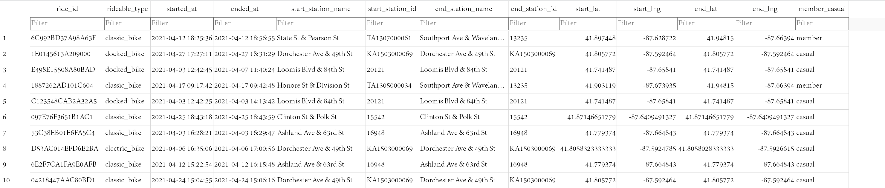

# GDAC-CaseStudy1-Cyclistic
**Ziyi Xu, April 2022**


# Introduction (Scenario)

Cyclistic is a bike-share company in Chicago. The director of marketing believes the company’s future success depends on maximizing the number of annual memberships. As a member of marketing analyst team at Cyclistic, the analyst will need to understand how casual riders and annual members use Cyclistic bikes differently. Then from these insights, the analyst team will design a new marketing strategy to convert casual riders into annual members. But first, Cyclistic executives must approve my recommendations, so they must be backed up with compelling data insights and professional data visualizations.

This scenario relates to real-world obstacles as companies with user data would need to use data analytics for better understanding of customers and then make data-driven decisions to further improve their businesses. The case study would trial the analyst’s capabilities on data analytics.

# Case Study P**hase** 1 - Ask

### The Project's Goal:

Design new marketing strategies to convert casual riders (with single-ride or full-day passes) into annual members (with annual memberships) for Cyclistic’s future growth.

### Business Task (The Question to Answer):

Determine how annual members and casual riders use Cyclistic bikes differently.
*(Three questions will guide the future marketing program. This is the first question to answer, assigned to the analyst, by Moreno. For reference, the other two are: Why would casual riders buy Cyclistic annual memberships & How can Cyclistic use digital media to influence casual riders to become members)*

### The key stakeholders:

**Lily Moreno:** The director of marketing and the analyst’s manager, responsible for the development of campaigns and initiatives to promote the bike-share program.

**Cyclistic executive team:** Responsible for Cyclistic’s future strategy and success. The detail-oriented executive team will decide whether to approve the recommended marketing program.

**Cyclistic marketing analytics team:** Other members could be covering different aspects of user data and have own roles on the project. Insights from the analyst on usage difference could be required for designing a new marketing strategy next.

### Other Points:

- Problem type (one of six): 
Finding patterns - Using historical data to understand what happened in the past and is therefore likely to happen again.
- While the question to answer is assigned this time, we should ask SMART questions that are Specific, Measurable, Action-oriented, Relevant and Time-bound when determining problem type and crafting own questions to address the main task/goal.
- Explore the dataset and its metrics
- Communicate with managers and stakeholders to clarify any ambiguity in goals, questions and datasets (if possible).

# Case Study P**hase 2** - Prepare

(Note: The data is public data that has been made available by Motivate International Inc. under this [license](https://www.divvybikes.com/data-license-agreement). The data is used here for the purpose of this Cyclistic case study and the differing in dataset name is intended and appropriate.)

### Data Exploration

- Cyclistic’s historical trip data of previous 12 months, from Apr 2021 to Mar 2022, is used to analyze and identify trends.
- For the analysis in this case study, existing data would be used. The data is presumably internal data/primary data whose data source is the own company. This data is presumably first-party data that is collected by the company itself.
- The dataset contains structured data. It’s organized in CSV format with rows and columns (by comma). The dataset comes in 12 separate CSV files representing trip data monthly.
- Data fields of the dataset contains: ride_id, rideable_type, started_at, ended_at, start_station_name, start_station_id, end_station_name, end_station_id, start_lat, start_lng, end_lat, end_lng, member_casual.

### Data Integrity

- The data is public data under a license. A degree of data anonymization is already in place for data privacy.
- Data Credibility - ROCCC Analysis
    - R - Reliable: Yes, digitally collected and structured within the company network, the data  should be accurate, complete and unbiased.
    - O - Original: Yes, internal data from the own company.
    - C - Comprehensive: Not quite. Most related ride info is presented in the dataset, with some exceptions:
        - Due to data-privacy issues, riders’ personally identifiable information is not available in the dataset. This means it’s not possible to group user’s rides or to determine whether they have purchased multiple single passes. It will bring certain limitations to the analysis as all rides will be viewed as individual rides.
        - While the rideable_type field is supplied in the dataset, only rides of traditional two-wheeled bikes (3 types) are available. Assistive rides of special bikes like reclining bikes, hand tricycles, and cargo bikes accounts for 8% and are not reflected in the dataset. Hence, this limits the analysis to only traditional two-wheeled bikes (3 types).
    - C - Current: Yes, the latest dataset containing the previous 12 months’ trip data is used.
    - C - Cited: Yes, this data has been vetted (or cited in some cases) by the internal data science team presumably.
- Ensure the data is unbiased and objective. Check data collection process for Sampling bias and watch for Observer bias, Interpretation bias, Confirmation bias in the analysis process.
- Make sure the data helps answer the analyst’s question. Ask further questions about any doubtful point.

### Data Organization & Protection

- The dataset is downloaded and then stored hierarchically in the specific project folder separately from completed work. Using (agreed) naming conventions like 2022Apr_Cyclistic_UserData_Yearly-Rev01. Certain encryption or authentication could be used under the company policy to balance the security and accessibility of data.

# Case Study P**hase 3** - Process

## Route 1 - SQL

- Considering that there are more than 5 million records in the dataset, SQL instead of Excel is used for this task.
- All 12 CSV files have been imported to a new database to create a table named ‘TripData’ (in line with the CamelCase naming conventions for tables). Original column (field) names are used in the table as they are supplied in the csv files (also in line with the snake_case naming conventions for columns). Proper data type for each field is chosen.
- The started_at and ended_at field is of datetime type. This ensures the consistency of dates in the data.
- Use SQL statement `SELECT DISTINCT member_casual FROM TripData` & `SELECT DISTINCT rideable_type FROM TripData` to confirm the records in the member_casual & rideable_type field is clean. Two types: member and casual in member_casual field and three types: classic_bike, docked_bike, electric_bike in rideable_type have been found as expected. No inconsistency or misspelling exists.
- Use SQL statement `SELECT ride_id, count(ride_id) FROM TripData GROUP BY ride_id HAVING count(ride_id)>1` to confirm that no duplicate record exists in the dataset (by ride_id).
- Handle of NULL Cells
    - Certain number of NULL cells have been found using SQL statement `SELECT * FROM TripData WHERE [field_name] IS NULL`. The fields with NULL values are: start_station_name, start_station_id, end_station_name, end_station_id, end_lat, end_lng.
    - After careful examination, it is found that:
        - Although some records have NULL cells in end_station_name and end_station_id, part of them have the corresponding geo-coordinate values in end_lat and end_lng.
        - All records with non-null end_station_name and end_station_id values have non-null end_lat and end_lng values.
        - Apparently all records with null value in start_station_name and start_station_id have the corresponding geo-coordinate values in start_lat and start_lng (all non-null values inside). Using SQL statement `SELECT DISTINCT rideable_type FROM TripData WHERE start_station_id IS NULL`, it is known that these records is of ‘electric_bike’ rideable_type only.
    - It’s reasonable to take the records with non-null geo-coordinates of start AND end as valid records, despite of the null values in station-related fields, as these records could arise from non-docked rides of electric bikes.
    - To be specfic, for this dataset, only records with NULL end_lat and end_lng values are regarded as invalid. These invalid records would be excluded in the analysis later.
- Till now, the dataset has been transformed into database, checked for errors and cleaned for further analysis in SQL effectively.

## Route 2 - R (Language)

For a dataset of such large size, R (Language) could also be used.

# Case Study P**hase 4** - Analyze

In this phase, data is organized, formatted, calculated and aggregated by rider type (member or casual) by the analyst in order to identify trends and relationships in the dataset. Multiple SQL queries are composed and the corresponding results are gathered in a spreadsheet.

- Original Dataset Preview
    
    
    
- Rides of bike type
    
    ```sql
    WITH temp_table AS (
    SELECT
    	COUNT(*) AS num_rides, rideable_type, member_casual
    FROM
    	TripData
    WHERE
    	end_lat IS NOT NULL AND end_lng IS NOT NULL
    GROUP BY
    	member_casual, rideable_type
    )
    	
    SELECT
    	(SELECT SUM(num_rides) FROM temp_table) AS total_rides,
    	CASE member_casual
    		WHEN "casual" THEN CAST((SELECT SUM(num_rides) FROM temp_table WHERE member_casual="casual") AS REAL)
    		WHEN "member" THEN CAST((SELECT SUM(num_rides) FROM temp_table WHERE member_casual="member") AS REAL)
    		ELSE "Error"
    	END AS num_by_rider_type,
    	*,
    	CASE member_casual
    		WHEN "casual" THEN num_rides/CAST((SELECT SUM(num_rides) FROM temp_table WHERE member_casual="casual") AS REAL)
    		WHEN "member" THEN num_rides/CAST((SELECT SUM(num_rides) FROM temp_table WHERE member_casual="member") AS REAL)
    		ELSE "Error"
    	END AS percent_by_rider_type
    FROM temp_table
    GROUP BY
    	member_casual, rideable_type
    ```
    
    | total_rides | num_by_
    rider_type | num_rides | rideable_type | member_casual | percent_by_
    rider_type |
    | --- | --- | --- | --- | --- | --- |
    | 5718816 | 2542892 | 1254458 | classic_bike | casual | 0.49331942 |
    | 5718816 | 2542892 | 303524 | docked_bike | casual | 0.11936173 |
    | 5718816 | 2542892 | 984910 | electric_bike | casual | 0.38731885 |
    | 5718816 | 3175924 | 1991982 | classic_bike | member | 0.62721337 |
    | 5718816 | 3175924 | 1183942 | electric_bike | member | 0.37278663 |
    
    Using SQL statement to calculate the total ride numbers, number of rides per rider type (members or casual riders), num_rides per bike type and rider type (the finest granularity), and the percentage of num_rides in num_by_rider_type.
    
- Ride Length by Rider Type
    
    ```sql
    SELECT
    	AVG((JulianDay(ended_at)-JulianDay(started_at))*24*60) AS avg_length_min,
    	member_casual
    FROM
    	TripData
    WHERE
    	end_lat IS NOT NULL AND end_lng IS NOT NULL 
    	AND
    	(JulianDay(ended_at)-JulianDay(started_at))*24*60 >= 1
    GROUP BY
    	member_casual
    ```
    
    Using SQL statement to calculate the average ride length in minutes by members and casual riders. Note that there are a few records whose ride length is negative and hence discarded. Also, records with ride length less than 1 minute are regarded as potential false starts or redocking and hence excluded as well.
    
    | avg_length_min | member_casual |
    | --- | --- |
    | 30.14 | casual |
    | 13.34 | member |
    
    ```sql
    SELECT
    	(JulianDay(ended_at)-JulianDay(started_at))*24*60 AS length_min,
    	member_casual
    FROM
    	TripData
    WHERE
    	end_lat IS NOT NULL AND end_lng IS NOT NULL 
    	AND
    	(JulianDay(ended_at)-JulianDay(started_at))*24*60 >= 1
    ORDER BY
    	length_min, member_casual
    ```
    
    A full table with ride length and rider type is also calculated and exported as CSV file for visualization later. A preview, with shortest and longest rides, is supplied as follows.
    
    | length_min | member_casual |
    | --- | --- |
    | 1.00000061094761 | casual |
    | 1.00000061094761 | member |
    | 1499.93333280087 | member |
    | 55944.1499999911 | casual |
- Ride Number by Length Groups & Rider
    
    ```sql
    SELECT
    	COUNT(*) AS num_of_rides,
    	CASE 
    		WHEN (JulianDay(ended_at)-JulianDay(started_at))*24*60<5 THEN "1-5MIN"
    		WHEN (JulianDay(ended_at)-JulianDay(started_at))*24*60<10 THEN "5-10MIN"
    		WHEN (JulianDay(ended_at)-JulianDay(started_at))*24*60<15 THEN "10-15MIN"
    		WHEN (JulianDay(ended_at)-JulianDay(started_at))*24*60<30 THEN "15-30MIN"
    		WHEN (JulianDay(ended_at)-JulianDay(started_at))*24*60<60 THEN "30-60MIN"
    		WHEN (JulianDay(ended_at)-JulianDay(started_at))*24*60<120 THEN "60-120MIN"
    		ELSE ">120MIN"
    	END AS classification,
    	member_casual
    FROM
    	TripData
    WHERE
    	end_lat IS NOT NULL AND end_lng IS NOT NULL 
    	AND
    	(JulianDay(ended_at)-JulianDay(started_at))*24*60 >= 1
    GROUP BY
    	classification, member_casual
    ORDER BY
    	classification, member_casual
    ```
    
    Using SQL statement to calculate the number of rides by different ride length groups and rider type.
    
    - Table Here
        
        
        | num_of_rides | classification | member_casual |
        | --- | --- | --- |
        | 187498 | 1-5MIN | casual |
        | 638702 | 1-5MIN | member |
        | 528482 | 5-10MIN | casual |
        | 996213 | 5-10MIN | member |
        | 464153 | 10-15MIN | casual |
        | 593250 | 10-15MIN | member |
        | 727168 | 15-30MIN | casual |
        | 665025 | 15-30MIN | member |
        | 383151 | 30-60MIN | casual |
        | 204336 | 30-60MIN | member |
        | 161683 | 60-120MIN | casual |
        | 17399 | 60-120MIN | member |
        | 55327 | >120MIN | casual |
        | 6232 | >120MIN | member |
- Ride Number per day of the week
    
    ```sql
    SELECT
    	COUNT(*) AS num_of_rides,
    	CASE CAST(STRFTIME('%w',started_at) AS REAL)
    		WHEN 0 THEN "Sunday"
    		WHEN 1 THEN "Monday"
    		WHEN 2 THEN "Tuesday"
    		WHEN 3 THEN "Wednesday"
    		WHEN 4 THEN "Thursday"
    		WHEN 5 THEN "Friday"
    		WHEN 6 THEN "Saturday"
    		ELSE "Error"
    		END AS day_of_week,
    	member_casual
    FROM
    	TripData
    WHERE 
    	end_lat IS NOT NULL AND end_lng IS NOT NULL
    GROUP BY
    	day_of_week, member_casual
    ORDER BY 
    	STRFTIME('%w',started_at)
    ```
    
    Using SQL statement to calculate the number of rides per day of week by members and casual riders.
    
    | num_of_rides | day_of_week | member_casual |
    | --- | --- | --- |
    | 482070 | Sunday | casual |
    | 387578 | Sunday | member |
    | 292573 | Monday | casual |
    | 439301 | Monday | member |
    | 276028 | Tuesday | casual |
    | 489954 | Tuesday | member |
    | 286049 | Wednesday | casual |
    | 499812 | Wednesday | member |
    | 293206 | Thursday | casual |
    | 475183 | Thursday | member |
    | 363771 | Friday | casual |
    | 452940 | Friday | member |
    | 549195 | Saturday | casual |
    | 431156 | Saturday | member |
- Ride Number per month
    
    ```sql
    SELECT
    	COUNT(*) AS num_of_rides,
    	STRFTIME('%m',started_at) AS month,
    	member_casual
    FROM
    	TripData
    WHERE 
    	end_lat IS NOT NULL AND end_lng IS NOT NULL
    GROUP BY
    	month, member_casual
    ORDER BY 
    	STRFTIME('%m',started_at)
    ```
    
    - Table Here
        
        
        | num_of_rides | month | member_casual |
        | --- | --- | --- |
        | 18463 | 1 | casual |
        | 85221 | 1 | member |
        | 21361 | 2 | casual |
        | 94171 | 2 | member |
        | 89644 | 3 | casual |
        | 194132 | 3 | member |
        | 136414 | 4 | casual |
        | 200549 | 4 | member |
        | 256577 | 5 | casual |
        | 274604 | 5 | member |
        | 370156 | 6 | casual |
        | 358722 | 6 | member |
        | 441473 | 7 | casual |
        | 380206 | 7 | member |
        | 412110 | 8 | casual |
        | 391536 | 8 | member |
        | 363467 | 9 | casual |
        | 392085 | 9 | member |
        | 256826 | 10 | casual |
        | 373916 | 10 | member |
        | 106786 | 11 | casual |
        | 253001 | 11 | member |
        | 69615 | 12 | casual |
        | 177781 | 12 | member |
    
    Using SQL statement to calculate the number of rides per month by members and casual riders.
    
- Route Frequency by Rider Type
    
    ```sql
    SELECT
    	COALESCE(start_station_name,ROUND(start_lat,3)||","||ROUND(start_lng,3))||" > "||COALESCE(end_station_name,ROUND(end_lat,3)||","||ROUND(end_lng,3)) AS route,
    	COUNT(*) AS num_rides,
    	ROUND(AVG((JulianDay(ended_at)-JulianDay(started_at)))*24*60,2) AS avg_length_min,
    	member_casual
    FROM
    	TripData
    WHERE
    	end_lat IS NOT NULL AND end_lng IS NOT NULL 
    	AND
    	(JulianDay(ended_at)-JulianDay(started_at))*24*60 >= 1
    GROUP BY
    	route, member_casual
    HAVING
    	num_rides > 2000
    ORDER BY
    	num_rides DESC, member_casual
    ```
    
    | route | num_rides | avg_length_min | member_casual |
    | --- | --- | --- | --- |
    | 41.79,-87.6 > 41.79,-87.6 | 13270 | 4.71 | member |
    | Streeter Dr & Grand Ave > Streeter Dr & Grand Ave | 11044 | 51.64 | casual |
    | Millennium Park > Millennium Park | 5533 | 52.82 | casual |
    | Michigan Ave & Oak St > Michigan Ave & Oak St | 5483 | 56.77 | casual |
    | 41.8,-87.59 > 41.8,-87.59 | 4693 | 11.52 | member |
    | Ellis Ave & 60th St > Ellis Ave & 55th St | 4589 | 5.98 | member |
    | Ellis Ave & 60th St > University Ave & 57th St | 4074 | 5.84 | member |
    | Ellis Ave & 55th St > Ellis Ave & 60th St | 4016 | 5.88 | member |
    | 41.79,-87.6 > 41.8,-87.59 | 3980 | 8.42 | member |
    | University Ave & 57th St > Ellis Ave & 60th St | 3961 | 5.28 | member |
    
    Using SQL statement, the most frequent route by rider type is queried, along with the number of rides and the average ride length in minutes. Route field is a concatenation of start station name and end station name, and for those undocked rides with NULL station names, geo coordinates are used instead. The geo coordinates (lat and lng) are rounded to 3 decimal places for better grouping. Ride routes of more than 2000 times are exported, consisting of 32 records, while the top 10 results are displayed here.
    

### Summary

A spreadsheet summary file of the queried tables/results above is created at this phase. The file will be used for visualization at the next phase (share), and all the patterns, relationships, and trends identified will be presented in the next phase (share) as well.

# Case Study P**hase 5** - Share

In this phase, Microsoft Excel and Tableau will be used to generate visualization.

A presentation with slides is designed further. Refer to the PPTX file in the next section.

---

- Overall average ride length varies among annual members and casual riders.
- Rides by annual members generally takes much less time than rides by casual riders.
- The average ride length by annual members is 13.3 minutes.
- The average ride length by casual riders is
30.1 minutes.


- The overall number of rides queried is
5.72 million.
- Among these, 3.18 million rides are annual members trips, and 2.54 million rides are casual rider trips.
- While the rider number of each type is not disclosed, more rides are conducted by annual members than casual riders.


- (Recap)
The overall number of rides - 5.72 million.
Annual members trips – 3.18 million
Casual rider trips - 2.54 million
- Generally the proportion of rides of each bike type resembles in two rider types.
- More Classic bikes are ridden than Electric bikes, both for annual members and casual riders.


- The trend of rides by week day contrasts between annual members and casual riders.
- Annual members has far more rides on workdays than casual riders, especially on the middle of the week.
- Number of rides by annual members is relatively stable in general.
- Casual riders has more rides on weekends than members, but the number drops quickly on workdays, almost half of the weekend figure.


- Bar Chart (Collapsed)
    
    
    
- Number of rides varies greatly, rising on summer and falling on winter.
- Although generally there are more rides by members, the number of rides by casual members overtakes on mid-summer (June, July, August).

🛆 The Number of Rides by Hours & Rider could also be queried and analyzed.


- Frequent routes are grouped and calculated. Non-docked rides are expressed using geo-coordinates. Round rides are also marked at the end of each bar.
- Around half of the most frequent routes are round rides, however these frequent routes are generally attributed to casual riders.
- The proportion of frequent routes by annual members generally resembles those by casual riders (half-half).
- The top two routes are extremely popular, and then the popularity of other routes gradually declines.

🛆 The Heat Map representing the frequent routes could also be created to better visualize the route data above.

---

### Conclusion - **Key Findings**

Compared to casual riders:

- Members carried out more rides.
- Members tend to have shorter (half-long) rides.
- Annual members has far more rides on workdays, but falling behind on weekends. Their usage is quite stable across whole week.
- Number of rides by members rises slower from winter to summer and is overtaken on mid-summer (Jun, Jul, Aug).
- Few frequent routes by members are round rides, far less then casual riders.

# Case Study P**hase 6** - Act

### Recommendations

- Design membership advertising strategy for casual riders who have frequent short rides.
- Promote a time-limited offer on annual membership on summer weekends for casual riders, or design a special annual membership for weekend rides only.
- Implement automatic calculation to convey expected savings through annual memberships to target casual riders mentioned above.

### Limitations for Further Analysis

- It’s currently not possible to group each rider’s trips. Anonymous UserID could be provided in the trip data so that trends and patterns could be better identified.
- Assistive rides of special bikes which accounts for 8% are not reflected in the dataset. This could bias the analysis and obstruct analyst from getting the full picture.
- Certain data integrity problems has been encountered. Ask related managers about these issues for clarification and solve them outright when possible.

### Presentation Slides
Please use the following link for the presentation slides. (GitHub doesn't support preview of slides for now, so please download the pptx file before viewing it.)

https://github.com/Redbird10/Google-Data-Analytics_Cyclistic-bike-share-analysis/blob/main/GDAC-CaseStudy1-Cyclistic.pptx

---
